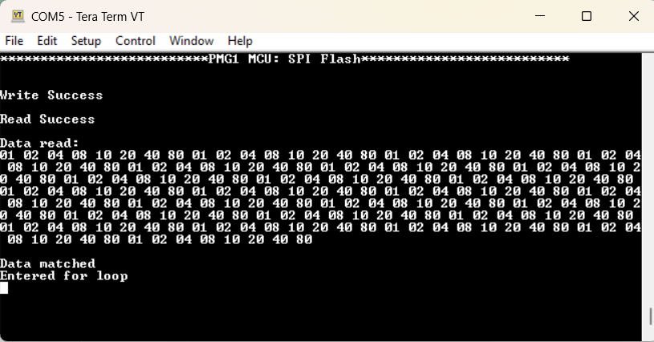
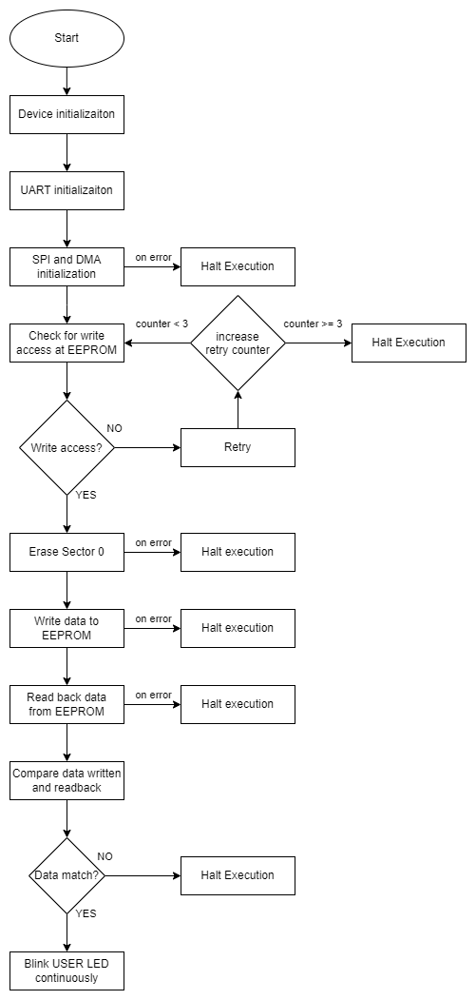
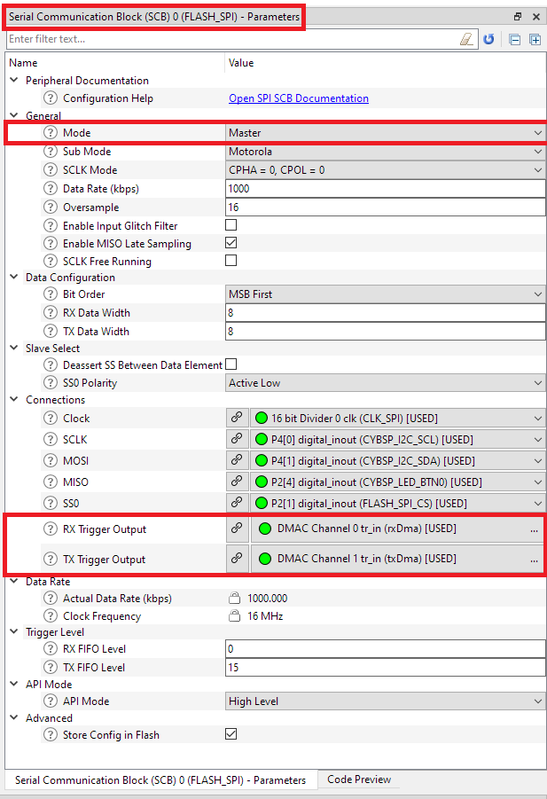
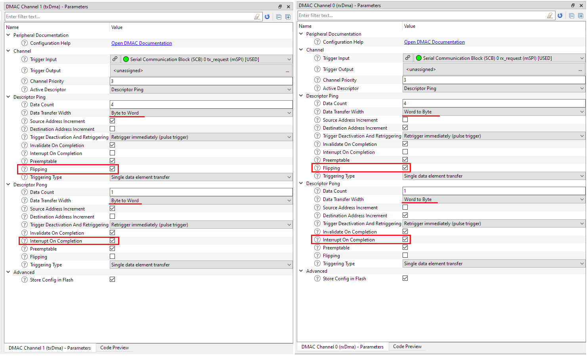

# EZ-PD&trade; PMG1 MCU: SPI flash

This code example demonstrates the configuration and usage of Serial Communication Block (SCB) as SPI master to write and read data to an EEPROM flash (slave)

[View this README on GitHub.](https://github.com/Infineon/mtb-example-pmg1-spi-master-dma)

[Provide feedback on this code example.](https://cypress.co1.qualtrics.com/jfe/form/SV_1NTns53sK2yiljn?Q_EED=eyJVbmlxdWUgRG9jIElkIjoiQ0UyMzM4MjQiLCJTcGVjIE51bWJlciI6IjAwMi0zMzgyNCIsIkRvYyBUaXRsZSI6IkVaLVBEJnRyYWRlOyBQTUcxIE1DVTogU1BJIGZsYXNoIiwicmlkIjoibnNoIiwiRG9jIHZlcnNpb24iOiIxLjAuMCIsIkRvYyBMYW5ndWFnZSI6IkVuZ2xpc2giLCJEb2MgRGl2aXNpb24iOiJNQ0QiLCJEb2MgQlUiOiJXSVJFRCIsIkRvYyBGYW1pbHkiOiJUWVBFLUMifQ==)

## Requirements

- [ModusToolbox&trade; software](https://www.infineon.com/modustoolbox) v3.0 or later (tested with v3.0)
- Board support package (BSP) minimum required version: 3.0.0
- Programming language: C
- Associated parts: [EZ-PD&trade; PMG1-S3 prototyping kit](https://www.infineon.com/CY7113) (`PMG1-CY7113`)

## Supported toolchains (make variable 'TOOLCHAIN')

- GNU Arm&reg; embedded compiler v10.3.1 (`GCC_ARM`) - Default value of `TOOLCHAIN`
- Arm&reg; compiler v6.16 (`ARM`)
- IAR C/C++ compiler v9.30.1 (`IAR`)

## Supported kits (make variable 'TARGET')

- [EZ-PD&trade; PMG1-S3 prototyping kit](https://www.infineon.com/CY7113) (`PMG1-CY7113`)

## Hardware setup

1. Use jumper wires to establish a connection between the PMG1-S3 (master) and an EEPROM SPI flash device (slave) as shown in **Table 1**.

**Table 1. Pin identification for SPI master**

| Development kit |     MOSI      |     MISO      |     SCLK      |     CS        | Ground |
| :-------------- | :------------ | :------------ | :------------ | :------------ | :----- |
| PMG1-S3         | J7.6 (P4.1)  | J6.14 (P2.4) | J7.7 (P4.0)  | J6.16 (P2.1) |  J6.18 (GND)  |

2. If UART DEBUG PRINT messages are enabled, UART connection is needed. For kit version older than **CY7113 board revision 3 or lower**, Connect the UART TX and UART RX lines from the PMG1 kit to J3.8 and J3.10 on KitProg3 respectively to establish a UART connection between KitProg3 and PMG1-S3 device. See [Compile-time configurations](#compile-time-configurations) for more details.

**Note:** All prototyping kits with a higher revision have UART lines internally connected. Therefore, external wiring is not required.

## Software setup

Install a terminal emulator if you don't have one. Instructions in this document use [Tera Term](https://ttssh2.osdn.jp/index.html.en).

This example requires no additional software or tools.

## Using the code example

Create the project and open it using one of the following:

<details><summary><b>In Eclipse IDE for ModusToolbox&trade; software</b></summary>

1. Click the **New Application** link in the **Quick Panel** (or, use **File** > **New** > **ModusToolbox&trade; Application**). This launches the [Project Creator](https://www.infineon.com/ModusToolboxProjectCreator) tool.

2. Pick a kit supported by the code example from the list shown in the **Project Creator - Choose Board Support Package (BSP)** dialog.

   When you select a supported kit, the example is reconfigured automatically to work with the kit. To work with a different supported kit later, use the [Library Manager](https://www.infineon.com/ModusToolboxLibraryManager) to choose the BSP for the supported kit. You can use the Library Manager to select or update the BSP and firmware libraries used in this application. To access the Library Manager, click the link from the **Quick Panel**.

   You can also just start the application creation process again and select a different kit.

   If you want to use the application for a kit not listed here, you may need to update the source files. If the kit does not have the required resources, the application may not work.

3. In the **Project Creator - Select Application** dialog, choose the example by enabling the checkbox.

4. (Optional) Change the suggested **New Application Name**.

5. The **Application(s) Root Path** defaults to the Eclipse workspace which is usually the desired location for the application. If you want to store the application in a different location, you can change the *Application(s) Root Path* value. Applications that share libraries should be in the same root path.

6. Click **Create** to complete the application creation process.

For more details, see the [Eclipse IDE for ModusToolbox&trade; software user guide](https://www.infineon.com/MTBEclipseIDEUserGuide) (locally available at *{ModusToolbox&trade; software install directory}/docs_{version}/mt_ide_user_guide.pdf*).

</details>

<details><summary><b>In command-line interface (CLI)</b></summary>

ModusToolbox&trade; software provides the Project Creator as both a GUI tool and the command line tool, "project-creator-cli". The CLI tool can be used to create applications from a CLI terminal or from within batch files or shell scripts. This tool is available in the *{ModusToolbox&trade; software install directory}/tools_{version}/project-creator/* directory.

Use a CLI terminal to invoke the "project-creator-cli" tool. On Windows, use the command line "modus-shell" program provided in the ModusToolbox&trade; software installation instead of a standard Windows command-line application. This shell provides access to all ModusToolbox&trade; software tools. You can access it by typing `modus-shell` in the search box in the Windows menu. In Linux and macOS, you can use any terminal application.

The "project-creator-cli" tool has the following arguments:

Argument | Description | Required/optional
---------|-------------|-----------
`--board-id` | Defined in the `<id>` field of the [BSP](https://github.com/Infineon?q=bsp-manifest&type=&language=&sort=) manifest | Required
`--app-id`   | Defined in the `<id>` field of the [CE](https://github.com/Infineon?q=ce-manifest&type=&language=&sort=) manifest | Required
`--target-dir`| Specify the directory in which the application is to be created if you prefer not to use the default current working directory | Optional
`--user-app-name`| Specify the name of the application if you prefer to have a name other than the example's default name | Optional

<br />

The following example clones the "[SPI Flash](https://github.com/Infineon/mtb-example-pmg1-spi-master-dma)" application with the desired name "MySPIFlash" configured for the *PMG1-CY7113* BSP into the specified working directory, *C:/mtb_projects*:

   ```
   project-creator-cli --board-id PMG1-CY7113 --app-id mtb-example-pmg1-spi-master-dma --user-app-name MySPIFlash --target-dir "C:/mtb_projects"
   ```

**Note:** The project-creator-cli tool uses the `git clone` and `make getlibs` commands to fetch the repository and import the required libraries. For details, see the "Project creator tools" section of the [ModusToolbox&trade; software user guide](https://www.infineon.com/ModusToolboxUserGuide) (locally available at *{ModusToolbox&trade; software install directory}/docs_{version}/mtb_user_guide.pdf*).

To work with a different supported kit later, use the [Library Manager](https://www.infineon.com/ModusToolboxLibraryManager) to choose the BSP for the supported kit. You can invoke the Library Manager GUI tool from the terminal using `make library-manager` command or use the Library Manager CLI tool "library-manager-cli" to change the BSP.

The "library-manager-cli" tool has the following arguments:

Argument | Description | Required/optional
---------|-------------|-----------
`--add-bsp-name` | Name of the BSP that should be added to the application | Required
`--set-active-bsp` | Name of the BSP that should be as active BSP for the application | Required
`--add-bsp-version`| Specify the version of the BSP that should be added to the application if you do not wish to use the latest from manifest | Optional
`--add-bsp-location`| Specify the location of the BSP (local/shared) if you prefer to add the BSP in a shared path | Optional

<br />

Following example adds the PMG1-CY7113 BSP to the already created application and makes it the active BSP for the app:

   ```
   ~/ModusToolbox/tools_3.0/library-manager/library-manager-cli --project "C:/mtb_projects/MySPIFlash" --add-bsp-name PMG1-CY7113 --add-bsp-version "latest-v3.X" --add-bsp-location "local"

   ~/ModusToolbox/tools_3.0/library-manager/library-manager-cli --project "C:/mtb_projects/MySPIFlash" --set-active-bsp APP_PMG1-CY7113
   ```

</details>

<details><summary><b>In third-party IDEs</b></summary>

Use one of the following options:

- **Use the standalone [Project Creator](https://www.infineon.com/ModusToolboxProjectCreator) tool:**

   1. Launch Project Creator from the Windows Start menu or from *{ModusToolbox&trade; software install directory}/tools_{version}/project-creator/project-creator.exe*.

   2. In the initial **Choose Board Support Package** screen, select the BSP, and click **Next**.

   3. In the **Select Application** screen, select the appropriate IDE from the **Target IDE** drop-down menu.

   4. Click **Create** and follow the instructions printed in the bottom pane to import or open the exported project in the respective IDE.

<br />

- **Use command-line interface (CLI):**

   1. Follow the instructions from the **In command-line interface (CLI)** section to create the application.

   2. Export the application to a supported IDE using the `make <ide>` command.

   3. Follow the instructions displayed in the terminal to create or import the application as an IDE project.

For a list of supported IDEs and more details, see the "Exporting to IDEs" section of the [ModusToolbox&trade; software user guide](https://www.infineon.com/ModusToolboxUserGuide) (locally available at *{ModusToolbox&trade; software install directory}/docs_{version}/mtb_user_guide.pdf*).

</details>


## Operation

1. Ensure to complete  the steps listed in the [Hardware setup](#hardware-setup) section.

2. Enable programmming, by placing the jumper shunt on power selection jumper (J5) at position 2-3.

3. Connect the board to the PC using the USB cable through the KitProg3 USB Type-C port (J1). This cable is used for programming the EZ-PD&trade; PMG1-S3 device and as a USB-to-UART bridge to the PC during operation.

4. Program the board using one of the following:

   <details><summary><b>Using Eclipse IDE for ModusToolbox&trade; software</b></summary>

      1. Select the application project in the Project Explorer.

      2. In the **Quick Panel**, scroll down, and click **\<Application Name> Program (KitProg3_MiniProg4)**.
   </details>

   <details><summary><b>Using CLI</b></summary>

     From the terminal, execute the `make program` command to build and program the application using the default toolchain to the default target. The default toolchain and target are specified in the application's Makefile but you can override these values manually:
      ```
      make program TOOLCHAIN=<toolchain>
      ```

      Example:
      ```
      make program TOOLCHAIN=GCC_ARM
      ```
   </details>

5. After programming the kit, disconnect the USB cable and change the position on power selection jumper (J5) to 1-2 to power the kit through the PMG1 USB PD sink port (J10).

6. Connect the USB cable back to KitProg3 USB Type-C port (J1).

7. Open a terminal program and select the KitProg3 COM port. Set the serial port parameters to 8N1 and 115200 baud.

8. Connect the PMG1 USB PD Sink Port (J10) to a USB-C power adapter or your PC using a USB Type-C cable to power the kit.

9. The application starts automatically. The logs will be visible on the UART terminal if DEBUG messages are enabled (See [Compile-time-configurations](#compile-time-configurations))

**Figure 1. Sample output**



10. Confirm that the kit user LED (LED3) blinks at approximately 1 Hz.

## Debugging

You can debug the example to step through the code. In the IDE, use the **\<Application Name> Debug (KitProg3_MiniProg4)** configuration in the **Quick Panel**.

Ensure that the board is connected to your PC using the USB cable through the KitProg3 USB Type-C port (J1) and that the jumper shunt on the power selection jumper (J5) is placed at position 1-2.

## Design and implementation

**Figure 2. Firmware flowchart**



SPI is initialized with the following settings as shown in **Table 2**.

**Table 2. SPI initialization values**

| SPI settings | Value |
| :----------- | :---- |
| Name| Flash_SPI |
| Mode| Master |
| Sub mode| Motorola |
| SCLK mode| CPHA = 0, CPOL = 0 |
| Data rate| 1000 |
| Oversample| 16 |
| Bit order| MSB First |
| RX Data width| 8 |
| TX Data width| 8 |
| RX FIFO level| 0 |
| TX FIFO level| 15 |

This code example uses *SCB 0* configured as SPI interface. Most settings are defaults (See **Table 2**). Configure the RX trigger output and TX trigger output to their respective DMAC channels.

The address width used in EEPROM device has to be set as part of SPI configuration. The default address width is `24-bit` which is typical to most devices. To change the address width of the EEPROM device, see [Compile-time configurations](#compile-time-configurations).

**Figure 3. SPI configuration**

 

DMA uses *PING* and *PONG* descriptors to allow continuous data transfer from and to multiple buffers. The *PING* descriptor is used to send the required *COMMAND* and *ADDRESS* to the EEPROM device (slave). After that the *PONG* descriptor is executed, either sending more data for read or write access. Some particularly small commands (i.e., *spi_eeprom_write_enable*) can be executed using one buffer, these only use *PONG* descriptor.

The configuration for TX and RX DMA is similar. **Figure 4** gives the configuration for TX and RX channels.

Most important is to check the *Flipping* attribute of the *PING* descriptor, so that the *PONG* descriptor is executed after the *PING* descriptor. Data size of the FIFO buffer is word where the *Transfer Width* for TX is always from byte to word and  the *Transfer Width* for RX is always from word to byte. It is also important to set the *Interrupt on Completion* attribute for both *PONG* descriptors. This will trigger the respective DMA interrupt which in turn sets the *done* flag to 'True'. Thus, indicates the transfer is completed.

**Figure 4. DMA configuration (TX left, RX right)**

 

After initialization all functions are ready to use. 
**Note:**

 * All functions should wait for *spi_eeprom_done* before issuing new commands to the device. *spi_eeprom_done* in turn waits for *dma_state_done* (or errors to occur).
 * After writing data, it is required to wait until *SPI_EEPROM_STAT_REG_WIP* (**W**rite-**I**n-**P**rogess) of status register to be cleared before reading data, otherwise all data received will be *0xFF*. To do so, in the current implementation there is a small hack in the *dmaCompletionCallback*: We know that the SPI is free after DMA completion. So, we will retrigger something similar to *spi_eeprom_read_status_reg* without any checks until respective flag is cleared. Only after that the *dma_state_done* function returns finished state.
 * All addressing in read/write functions uses **PAGES** not addresses. A page has *EEPROM_PAGE_SIZE* (typically 256) bytes. At one time it is only possible to write up to one page. If more data is to be written, multiple calls must be made. For simplicity reading also only supports 256 bytes at a time. If it is required to skip the first **n** bytes of data and then start writing: build a write buffer with **n** times *0xFF*, then your data.

### Compile-time configurations

The EZ-PD&trade; PMG1 MCU SPI flash application functionality can be customized through a set of compile-time parameters that can be turned ON or OFF through the code.

 Macro name          | Description                           | Allowed values
 :------------------ | :------------------------------------ | :-------------
 `DEBUG_PRINT` (*main.c*)    | Debug print macro to enable UART print | 1 µ to enable <br> 0 µ to disable |
 `SET_EEPROM_ADDRESS_TYPE` (*spi_eeprom_master.h*) | Defines the address width in bits used to operate the EEPROM device. | EEPROM_ADDRESS_TYPE_8 <br> EEPROM_ADDRESS_TYPE_16 <br> EEPROM_ADDRESS_TYPE_24 <br> EEPROM_ADDRESS_TYPE_32 |

### Resources and settings

**Table 3. Application resources**

 Resource  |  Alias/object     |    Purpose |
 :-------- | :-------------    | :------------ |
 SCB (SPI) (BSP) | FLASH_SPI | SPI master to communicate with the EEPROM device |
 DMA (BSP) | txDma | Data transfer |
 DMA (BSP) | rxDma | Data transfer |
 UART (BSP) | CYBSP_UART | UART object used for Debug UART port |
 LED (BSP)| CYBSP_USER_LED| User LED to show the output |

<br />

## Related resources

Resources | Links
-----------|------------------
Application notes |[AN232553](https://www.infineon.com/an232553) – Getting started with EZ-PD&trade; PMG1 MCU on ModusToolbox&trade; software <br> [AN232565](https://www.infineon.com/an232565) – EZ-PD&trade; PMG1 hardware design guidelines and checklist
Code examples | [Using ModusToolbox&trade; software](https://github.com/Infineon/Code-Examples-for-ModusToolbox-Software) on GitHub
Device documentation |[EZ-PD&trade; PMG1 MCU datasheets](https://www.infineon.com/cms/en/product/universal-serial-bus-usb-power-delivery-controller/usb-c-and-power-delivery/ez-pd-pmg1-portfolio-high-voltage-mcus-usb-c-power-delivery/#!documents)
Development kits | Select your kits from the [Evaluation board finder](https://www.infineon.com/cms/en/design-support/finder-selection-tools/product-finder/evaluation-board) page
Libraries on GitHub | [mtb-pdl-cat2](https://github.com/Infineon/mtb-pdl-cat2) – Peripheral driver library (PDL) and docs <br> 
Tools  | [Eclipse IDE for ModusToolbox&trade; software](https://www.infineon.com/modustoolbox) <br> ModusToolbox&trade; software is a collection of easy-to-use software and tools enabling rapid development with Infineon MCUs, covering applications from embedded sense and control to wireless and cloud-connected systems using AIROC&trade; Wi-Fi and Bluetooth® connectivity devices

<br />

## Other resources

Infineon provides a wealth of data at [www.infineon.com](www.infineon.com) to help you select the right device, and quickly and effectively integrate it into your design.

## Document history

Document title: *CE233824* – *PMG1 MCU: SPI flash*

| Version | Description of change |
| ------- | --------------------- |
| 1.0.0   | New code example      |

------

All other trademarks or registered trademarks referenced herein are the property of their respective owners.

---------------------------------------------------------

© Cypress Semiconductor Corporation, 2023. This document is the property of Cypress Semiconductor Corporation, an Infineon Technologies company, and its affiliates ("Cypress").  This document, including any software or firmware included or referenced in this document ("Software"), is owned by Cypress under the intellectual property laws and treaties of the United States and other countries worldwide.  Cypress reserves all rights under such laws and treaties and does not, except as specifically stated in this paragraph, grant any license under its patents, copyrights, trademarks, or other intellectual property rights.  If the Software is not accompanied by a license agreement and you do not otherwise have a written agreement with Cypress governing the use of the Software, then Cypress hereby grants you a personal, non-exclusive, nontransferable license (without the right to sublicense) (1) under its copyright rights in the Software (a) for Software provided in source code form, to modify and reproduce the Software solely for use with Cypress hardware products, only internally within your organization, and (b) to distribute the Software in binary code form externally to end users (either directly or indirectly through resellers and distributors), solely for use on Cypress hardware product units, and (2) under those claims of Cypress’s patents that are infringed by the Software (as provided by Cypress, unmodified) to make, use, distribute, and import the Software solely for use with Cypress hardware products.  Any other use, reproduction, modification, translation, or compilation of the Software is prohibited.
<br />
TO THE EXTENT PERMITTED BY APPLICABLE LAW, CYPRESS MAKES NO WARRANTY OF ANY KIND, EXPRESS OR IMPLIED, WITH REGARD TO THIS DOCUMENT OR ANY SOFTWARE OR ACCOMPANYING HARDWARE, INCLUDING, BUT NOT LIMITED TO, THE IMPLIED WARRANTIES OF MERCHANTABILITY AND FITNESS FOR A PARTICULAR PURPOSE.  No computing device can be absolutely secure.  Therefore, despite security measures implemented in Cypress hardware or software products, Cypress shall have no liability arising out of any security breach, such as unauthorized access to or use of a Cypress product. CYPRESS DOES NOT REPRESENT, WARRANT, OR GUARANTEE THAT CYPRESS PRODUCTS, OR SYSTEMS CREATED USING CYPRESS PRODUCTS, WILL BE FREE FROM CORRUPTION, ATTACK, VIRUSES, INTERFERENCE, HACKING, DATA LOSS OR THEFT, OR OTHER SECURITY INTRUSION (collectively, "Security Breach").  Cypress disclaims any liability relating to any Security Breach, and you shall and hereby do release Cypress from any claim, damage, or other liability arising from any Security Breach.  In addition, the products described in these materials may contain design defects or errors known as errata which may cause the product to deviate from published specifications. To the extent permitted by applicable law, Cypress reserves the right to make changes to this document without further notice. Cypress does not assume any liability arising out of the application or use of any product or circuit described in this document. Any information provided in this document, including any sample design information or programming code, is provided only for reference purposes.  It is the responsibility of the user of this document to properly design, program, and test the functionality and safety of any application made of this information and any resulting product.  "High-Risk Device" means any device or system whose failure could cause personal injury, death, or property damage.  Examples of High-Risk Devices are weapons, nuclear installations, surgical implants, and other medical devices.  "Critical Component" means any component of a High-Risk Device whose failure to perform can be reasonably expected to cause, directly or indirectly, the failure of the High-Risk Device, or to affect its safety or effectiveness.  Cypress is not liable, in whole or in part, and you shall and hereby do release Cypress from any claim, damage, or other liability arising from any use of a Cypress product as a Critical Component in a High-Risk Device. You shall indemnify and hold Cypress, including its affiliates, and its directors, officers, employees, agents, distributors, and assigns harmless from and against all claims, costs, damages, and expenses, arising out of any claim, including claims for product liability, personal injury or death, or property damage arising from any use of a Cypress product as a Critical Component in a High-Risk Device. Cypress products are not intended or authorized for use as a Critical Component in any High-Risk Device except to the limited extent that (i) Cypress’s published data sheet for the product explicitly states Cypress has qualified the product for use in a specific High-Risk Device, or (ii) Cypress has given you advance written authorization to use the product as a Critical Component in the specific High-Risk Device and you have signed a separate indemnification agreement.
<br />
Cypress, the Cypress logo, and combinations thereof, WICED, ModusToolbox, PSoC, CapSense, EZ-USB, F-RAM, and Traveo are trademarks or registered trademarks of Cypress or a subsidiary of Cypress in the United States or in other countries. For a more complete list of Cypress trademarks, visit www.infineon.com. Other names and brands may be claimed as property of their respective owners.
